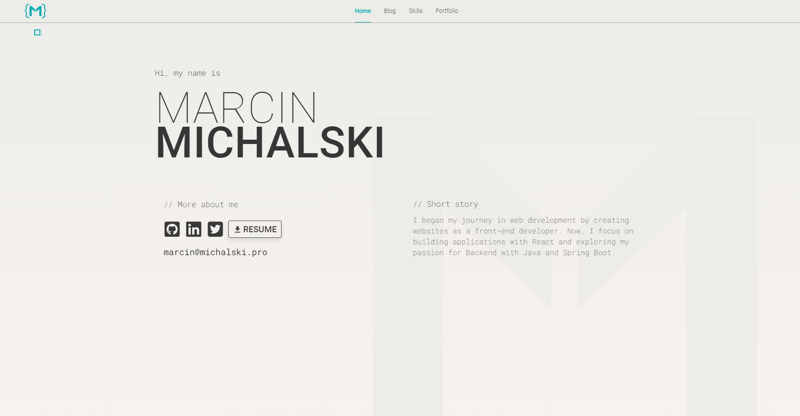

# Marcin Michalski - Portfolio Website

This is the repository for my personal portfolio website. It showcases my work, skills, blog posts, and provides ways to connect with me. The website is built using modern web technologies like React, TypeScript, and Framer Motion.


## Table of Contents
- [Demo](#demo)
- [Features](#features)
- [Technologies Used](#technologies-used)
- [Project Structure](#project-structure)
- [About the Website](#about-the-website)
- [WordPress Implementation](#wordpress-implementation)
- [Author](#author)

## Demo
You can check the live version of the portfolio [here](https://michalski.pro).

## Features
- **Personal Introduction**: Get to know more about me through an interactive intro on the homepage.
- **Project Showcase**: Explore some of my notable works, with links to GitHub repositories or live websites.
- **Blog**: Read about my thoughts, tips, and insights on various topics.
- **Responsive Design**: The website is fully responsive, ensuring a seamless experience on both desktop and mobile devices.
- **Smooth Navigation**: Utilize React Router for easy navigation between pages.

## Technologies Used
- **React**: For building the user interface.
- **TypeScript**: For type safety and better development experience.
- **Framer Motion**: For animations and transitions.
- **React Router**: For managing navigation and routing.

## Project Structure
```
src/
├── assets/
│   └── profilepic.svg
├── components/
│   ├── Animations.jsx
│   ├── ExpandedSkill.jsx
│   ├── GetData.jsx
│   ├── PostDetail.jsx
│   ├── PostList.jsx
│   ├── Project.jsx
│   ├── SelectedSkill.jsx
│   ├── Skill.jsx
│   └── navbar.jsx
├── data/
│   ├── About.jsx
│   ├── Blog.jsx
│   ├── Skills.jsx
│   └── Portfolio.jsx
├── pages/
│   ├── About.jsx
│   ├── Blog.jsx
│   ├── Skills.jsx
│   └── Portfolio.jsx
├── styles/
│   └── All CSS files for pages and components
├── App.css
├── App.jsx
├── main.jsx
└── index.css
```

## About the Website
This website also highlights accessibility, making sure that all users can navigate and interact with the content easily.

## WordPress Implementation
In addition to the React application, a WordPress backend is implemented to manage blog content dynamically. This integration allows for easy updates and content management without the need to redeploy the entire site. Blog posts can be created, edited, and published directly from the WordPress dashboard, while the React frontend fetches the latest posts using the WordPress REST API. This hybrid approach combines the flexibility of a static React site with the powerful content management capabilities of WordPress.

## Author
**Marcin Michalski**  
- [GitHub](https://www.github.com/michalski-marcin)  
- [LinkedIn](https://www.linkedin.com/in/michalski-marcin)
- [Website](https://michalski.pro)
